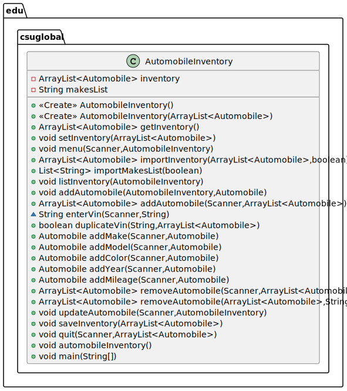

# Module 6: Portfolio Milestone


## Portfolio Milestone Assignment (50 Points)

### Option #1:

Submit document with methods for your automobile class, and pseudo code indicating functionality of each method.

Example:

```java
public String RemoveVehicle(String autoMake, String autoModel, String autoColor, int autoYear)
    If
       values entered match values stored in private variables
       remove vehicle information
    else
       return message indicating mismatch
```





## Automobile

```java
public class Automobile
```


###   Field Detail

####   vin

```java
private java.lang.String vin
```


####   make

```java
private java.lang.String make
```


####   model

```java
private java.lang.String model
```


####   color

```java
private java.lang.String color
```


####   year

```java
private java.time.Year year
```


####   mileage

```java
private int mileage
```


### Constructor Detail

####   Automobile ( )

```java
public Automobile()
```

Default constructor for the automobile class.


####   Automobile (String, String, String, String, Year, int)

```java
public Automobile(java.lang.String vin,
    java.lang.String make,
    java.lang.String model,
    java.lang.String color,
    java.time.Year year,
    int mileage)
```

Constructor for the automobile class.

##### Parameters:

vin - the vin number of the automobile

make - the make of the automobile

model - the model of the automobile

color - the color of the automobile

year - the `java.Time.Year` of the automobile

mileage - the odometer reading of the automobile


###   Method Detail

####   setVin

```java
public void setVin(java.lang.String vin)
```

Sets the VIN of the automobile

##### Parameters:

vin - the VIN of the automobile


####   setMake

```Java
public void setMake(java.lang.String make)
```

Sets the make of the automobile

##### Parameters:

make - the make of the automobile


####   setModel

```java
public void setModel(java.lang.String model)
```

Sets the model of the automobile

##### Parameters:

model - the model of the automobile


####   setColor

```java
public void setColor(java.lang.String color)
```

Sets the color of the automobile

##### Parameters:

color - the color of the automobile


####   setYear

```java
public void setYear(java.time.Year year)
```

Sets the year of the automobile.

##### Parameters:

year - the `java.Time.Year` of the automobile


####   setMileage

```Java
public void setMileage(int mileage)
```

Sets the odometer reading of the automobile

##### Parameters:

mileage - the odometer reading of the automobile


####   getVin

```Java
public java.lang.String getVin()
```

Returns the VIN of the automobile

##### Returns:

the VIN of the automobile


####   getMake

```Java
public java.lang.String getMake()
```

Returns the make of the automobile

##### Returns:

the make of the automobile


####   getModel

```Java
public java.lang.String getModel()
```

Returns the model of the automobile

##### Returns:

the model of the automobile


####   getColor

```Java
public java.lang.String getColor()
```

Returns the color of the automobile

##### Returns:

the color of the automobile


####   getYear

```Java
public java.time.Year getYear()
```

Returns the `java.Time.Year` of the automobile

##### Returns:

the `java.Time.Year` of the automobile


####   getYearAsString

```Java
public java.lang.String getYearAsString()
```

Returns the year of the automobile as a String

##### Returns:

the year of the automobile as a String


####   getMileage

```Java
public int getMileage()
```

Returns the odometer reading of the automobile

##### Returns:

the odometer reading of the automobile


####   getAutomobile

```Java
public java.lang.String[] getAutomobile()
```

Returns the automobile as a `String[]` array

##### Returns:

the automobile as a `String[]` array


####   toString

```java
public java.lang.String toString()
```

Returns the automobile as a String

##### Overrides:

toString in class `java.lang.Object`

##### Returns:

the automobile as a String


## AutomobileInventory

```Java
public class AutomobileInventory
```


### Field Detail

####   inventory

```Java
private java.util.ArrayList<Automobile> inventory
```

An `ArrayList` that stores the automobile inventory.


####   makesList

```Java
private java.lang.String makesList
```

The `filepath` to a valid list of automobile makes.


####   overrideMake

```Java
boolean overrideMake
```

Allows the user to enter a make not in the list of valid makes when true.


### Constructor Detail

####   AutomobileInventory

```Java
public class AutomobileInventory
```


### Method Detail

####   getInventory

```Java
public java.util.ArrayList<Automobile> getInventory()
```

Returns the `ArrayList` containing the inventory.


####   menu

```Java
public void menu(java.util.Scanner input, java.util.ArrayList<Automobile> inventory)
```

Main menu for the Automobile Inventory program. Allows the user to add, remove, update, import, list, and save automobiles, or quit. Prints a list of menu options to the console. Takes the first character from the user's input and processes it through a switch statement. Recursively reloads the menu after performing operations.

#####   Parameters:

input - `Scanner` for user input.

inventory - `ArrayList` of automobiles in current inventory.


####   importInventory

```Java
public java.util.ArrayList<Automobile> importInventory(java.util.Scanner input, java.util.ArrayList<Automobile> inventory, boolean initialImport)
```

Imports an automobile inventory from a CSV file. On program initiation, backs up the default file `automobileInventory.adb`, and imports the file into the program. If not during initialization, prompts the user to select a csv database file, limited to file extension adb.

#####   Parameters:

input - `Scanner` for user input

inventory - the automobile inventory

initialImport - true on program initialization, imports the default database if true.

#####   Returns:

the imported automobile inventory.


####   importMakesList

```Java
java.util.List<java.lang.String> importMakesList()
```

Imports a list of valid automobile makes from a file. Allows the user to select the list makes from a file chooser dialogue. Validates the list using a simple keyword at the beginning of the file. Returns null if there is no valid makes list chosen.

#####   Returns:

the list of valid automobile makes.


####   listInventory

```Java
public java.lang.String[] listInventory(java.util.Scanner input, java.util.ArrayList<Automobile> inventory)
```

Lists the automobiles in the inventory. If the inventory is empty, it will print an error message to the console. Creates a String[] of automobiles.

#####   Parameters:

input - `Scanner` used to prompt the user for input.

inventory - The current inventory.

#####   Returns:

a `String[]` array of the automobiles.


####   addAutomobile (AutomobileInventory, Automobile)

```Java
public AutomobileInventory addAutomobile(AutomobileInventory automobileInventory, Automobile automobile)
```

Adds an automobile to an `AutomobileInventory`. Prints a record of the automobile to the console. Returns the updated `AutomobileInventory`.

#####   Parameters:

automobileInventory - the `AutomobileInventory` to update.

automobile - the `Automobile` to create and add.

#####   Returns:

`AutomobileInventory` the updated `AutomobileInventory`.


####    addAutomobile (Scanner, ArrayList< Automobile >)

```Java
public java.util.ArrayList<Automobile> addAutomobile(java.util.Scanner input, java.util.ArrayList<Automobile> inventory)
```

Allows the user to add a new automobile to the inventory. VIN is entered directly in this method and may not be altered after Automobile record creation. VIN is checked against the inventory for duplicates or blanks. Provides some input verification of the make, color, and year through the called methods. Prints a record of the automobile to the console.

#####   Parameters:

input - `Scanner` used to prompt the user for input.

inventory - The current inventory.

#####   Returns:

The `Automobile` that was added.


####   duplicateVin

```Java
public boolean duplicateVin(java.lang.String vin, java.util.ArrayList<Automobile> inventory)
```

Used to check for duplicate VINs in the inventory. `importInventory()` will ignore duplicate VIN records.

#####   Parameters:

vin - The VIN from an imported file to check

inventory - The current inventory

#####   Returns:

true if the VIN is already in the inventory, false otherwise


####   addMake

```Java
Automobile addMake(java.util.Scanner input, Automobile automobile)
```

Adds or updates the make of an `Automobile` object. Prompts the user for a valid make from the automobile `makesList`. Suggests close matches if the user input does not match any of the automobile makes. Allows the user to override valid makes for makes not in the database and appends an asterisk to the make for database review.


#####   Parameters:

input - `Scanner` for user input.

automobile - the `Automobile` object to be updated.

#####   Returns:

the `Automobile` with the updated make.


####   addModel

```Java
Automobile addModel(java.util.Scanner input, Automobile automobile)
```

Adds or updates the model of an `Automobile`. Prompts the user for a model. Corrects capitalization if user does not capitalize the first letter of the model. No validation is performed other than a check for an empty String.

####   Parameters:

input - `Scanner` for user input.

automobile - the `Automobile` object to be updated.

####   Returns:

the `Automobile` with the updated model.


####   addColor

```Java
Automobile addColor(java.util.Scanner input, Automobile automobile)
```

Adds or updates the color of an `Automobile`. Prompts the user for a valid color from the  `openqa.selenium.support.Colors` Enum. Suggests close matches if the user input does not match any of the automobile colors.

#####   Parameters:

input - `Scanner` for user input.

automobile - the `Automobile` object to be updated.

#####   Returns:

the updated `Automobile` with the updated color.


####   addYear

```Java
Automobile addYear(java.util.Scanner input, Automobile automobile)
```

Adds or updates the year of an automobile. Prompts the user for a valid year from the automobile Year as a four-digit integer. Checks the year entered is between 1900 and the current year. Suggests close matches if the user input does not match any of the automobile years. Prompts user to enter -1 if year is unknown.

#####   Parameters:

input - `Scanner` for user input.

automobile - the `Automobile` object to be updated.

#####   Returns:

the updated `Automobile` with the updated year.


####   addMileage

```java
Automobile addMileage(java.util.Scanner input, Automobile automobile)
```

Adds or updates the odometer reading of an automobile. Allows the user to enter -1 if the odometer reading is invalid or unknown.

#####   Parameters:

input - `Scanner` for user input.

automobile - the `Automobile` object to be updated.

#####   Returns:

the `Automobile` with the updated odometer reading.


####   removeAutomobile (Scanner, ArrayList< Automobile >)

```Java
public java.util.ArrayList<Automobile> removeAutomobile(java.util.Scanner input, java.util.ArrayList<Automobile> inventory)
```

Removes an automobile from the automobile inventory using the VIN. Requests a VIN from the user, then uses `removeAutomobile(ArrayList<Automobile> inventory, String vin)` to remove the automobile from the inventory.

#####   Parameters:

input - `Scanner` for user input

inventory - the automobile inventory

#####   Returns:

the updated automobile inventory.


####   removeAutomobile (ArrayList< Automobile >, String)

```Java
public java.util.ArrayList<Automobile> removeAutomobile(java.util.ArrayList<Automobile> inventory, java.lang.String vin)
```

Removes an automobile from the automobile inventory using the VIN. Iterates through the automobile inventory until the VIN is found, then removes the automobile from the inventory. If the inventory does not contain the VIN, it prints an error message to the console.

#####   Parameters:

inventory - the automobile inventory

vin - the VIN of the `Automobile` to be removed.

#####   Returns:

the updated automobile inventory.


####   updateAutomobile

```Java
public java.util.ArrayList<Automobile> updateAutomobile(java.util.Scanner input, java.util.ArrayList<Automobile> inventory)
```

Allows the user to update an `Automobile` currently in the database. Prompts the user to select an `Automobile` from the automobile inventory using the VIN. Loops through the automobile inventory until the `Automobile` is found. If the `Automobile` is not found, it prints an error message to the console and returns to the main menu. If the `Automobile` is found, it displays a menu with options to update the `Automobile`. Then it returns the updated automobile inventory.

#####   Parameters:

input - `Scanner` for user input.

inventory - the automobile inventory.

#####   Returns:

the updated automobile inventory


####   saveInventory

```Java
public void saveInventory(java.util.Scanner input, java.util.ArrayList<Automobile> inventory)
```

Saves the automobile inventory. This will overwrite the existing default database file. In the case of an exception, it will print an error message to the console, and a list of the current inventory for possible salvage from the console log.

#####   Parameters:

input - `Scanner` to pass to `listInventory()` in the case of an exception.

inventory - the automobile inventory.


####   quit

```Java
public void quit(java.util.Scanner input, java.util.ArrayList<Automobile> inventory)
```

Asks the user if the automobile inventory should be saved, if yes, saves the inventory, then quits the program if yes or no. If the entry does not begin with y or n, it will print an error message to the console and restart the method. There is no "do you really want to quit?" message, user can re-run the program after quitting in error.

#####   Parameters:

input - `Scanner` used to prompt the user for input.

inventory - the modified automobile inventory.


####   automobileInventory

```Java
public static void automobileInventory()
```

This is the main entry method for the `automobileInventory` class. Creates a `Scanner` to be used throughout the program. Creates a new `automobileInventory` object. Creates a new `ArrayList` to be used throughout the program. Imports a default database file into the `ArrayList` and creates a backup in the `/bak/` directory. Prompts the user to start the `automobileInventory` program. Closes the `Scanner` and ends the program.


####   main

```Java
public static void main(java.lang.String[] args)
```

Runnable main method for the `automobileInventory` class.

#####   Parameters:

args - command line arguments (not used).


## APPENDIX A:

### Descriptions written by the TabNine AI

(Yes, they needed some editing by a Human...)

## package edu.csuglobal

##### AutomobileInventory.menu

The menu method is a crucial part of the Automobile Inventory program. It serves as the main entry point for the program, allowing the user to interact with the program by selecting one of the available options from the main menu. The method takes two parameters: input, which is a `Scanner` object for reading user input, and inventory, which is an `ArrayList` of `Automobile` objects that represents the inventory of automobiles in the program. The code starts by printing a welcome message to the console using the color method, which is a helper method that returns a formatted string with the specified color. The method then prints a list of menu options, along with their corresponding keys, which are used to identify the selected option. The method then loops continuously, prompting the user to enter an option and retrieving the first character of the input. It then processes the selected option by matching the first character with one of the available options and calling the corresponding method to perform the operation. For example, if the user selects the "A" option, the method calls the `addAutomobile()` method to add a new automobile to the inventory. If the user enters an empty input, the method reloads the menu by printing the list of options again. This allows the user to repeatedly select different options until they are ready to exit the program.

##### AutomobileInventory.importInventory

The `importInventory` method is a helper method that is used to import an automobile inventory from a CSV file. On program initialization, it backs up the default file `automobileInventory.adb`, and imports the file into the program. If not during initialization, it prompts the user to select a CSV database file, limited to file extension adb. The code starts by initializing a file variable to a new `File` object. If the program is not being initialized, it prompts the user to select a CSV database file. It then enters a try block to handle any exceptions that may occur during the import process. Within the `try` block, it checks if the program is being initialized. If it is, it sets the file variable to the default database file `automobileInventory.adb`. If not, it uses a `JFileChooser` to allow the user to select a CSV database file. It then enters a `try` block to handle any exceptions that may occur while reading the CSV file. Within the try block, it sets a variable `databasePath` to the full path of the CSV file. It then prints a success message to the console. If the program is being initialized, it checks if the default database file exists. If it does, it creates a backup file with a timestamped filename in the backup directory. It then copies the default database file to the backup directory. It then creates a CSVFormat object with the header fields vin, make, model, color, year, and mileage. It sets the `allowMissingColumnNames` property to true to allow missing columns in the CSV file, and sets the `skipHeaderRecord` property to `true` to skip the first record in the CSV file. It then creates an Iterable object from the CSV file using the `parse` method and the `CSVFormat` object. It then loops through the iterable object and creates an `Automobile` object for each record in the CSV file. It then checks if the VIN of the `Automobile` is a duplicate in the inventory. If it is not a duplicate, it adds the `Automobile` to the inventory and prints a success message to the console. Finally, the method returns the imported automobile inventory.

##### AutomobileInventory.importMakesList

The `importMakesList` method is responsible for importing a list of valid automobile makes from a file. It allows the user to select the list from a file chooser dialogue, and it validates the list by checking for a simple keyword at the beginning of the file. If the list is not valid, the method returns `null`. The code starts by creating a new `File` object for the list of automobile makes. If the `makesList` variable is `null`, the method creates a new `JFileChooser` object and sets some properties, such as the file filter and the dialog title. It then displays the file chooser dialogue and retrieves the selected file. If the user does not select a file, the method prints a message to the console and uses the default file path. It then sets the `makesList` variable to the selected file path and sets the `overrideMake` variable to false. The method then attempts to read the file using a `FileReader` object and the `CSVFormat` class from the Apache Commons CSV library. It uses the `parse` method to parse the file and iterate over the records. For each record, it adds the value at index 0 (which is the make) to an `ArrayList` called `autoMakesList`. Finally, the method checks if the `autoMakesList` contains the keyword "AutomobileInventoryMakeList". If it does not, the method prints an error message to the console and sets the `overrideMake` variable to `true`.

##### AutomobileInventory.listInventory

The `listInventory` method is a helper method that is used to list the automobiles in the inventory. If the inventory is empty, it prints an error message to the console. It creates a `String` array of the automobiles and loops through the inventory to add each `Automobile` to the array. It then returns the array to the calling method. The method starts by creating a new `String` array `inventoryAsStrings` with the size of the inventory. It then checks if the inventory is empty. If it is empty, it prints an error message to the console. It then loops through the inventory and prints each `Automobile` to the console. It creates a new `String` object for each `Automobile` and adds it to the `inventoryAsStrings` array. Finally, the method prints a message to the console and returns the `inventoryAsStrings` array to the calling method.

##### AutomobileInventory.addAutomobile (AutomobileInventory, Automobile)

This method adds the `Automobile` object passed in through the `automobile` parameter to the inventory and prints a success message to the console. It then returns the updated inventory.

##### AutomobileInventory.addAutomobile (Scanner, ArrayList< Automobile >)

The addAutomobile method is responsible for allowing the user to add a new automobile to the inventory. It prompts the user to enter the VIN of the automobile, and it checks the VIN against the inventory to ensure that it is not a duplicate or blank. It then provides some input verification of the make, color, and year by calling the `addMake`, `addModel`, `addColor`, and `addYear` methods. Finally, it prints a record of the `Automobile` to the console and returns the `Automobile` that was added. The code starts by importing the list of valid automobile makes using the importMakesList method. It then creates a new Automobile object and initializes some of its properties, such as the VIN. The method then enters a loop to prompt the user for the VIN. It checks if the input is "quit", which is used to exit the method. If the input is not blank and is not a duplicate VIN, it sets the VIN of the Automobile object. If the input is blank or a duplicate VIN, the method prints an error message and prompts the user to re-enter the VIN. The method then calls the `addMake`, `addModel`, `addColor`, and `addYear`  methods to add or update the make, model, color, and year of the automobile. These methods prompt the user for input and validate the input before updating the Automobile object. Finally, the method adds the `Automobile` object to the inventory and prints a success message to the console. It then returns the updated inventory.

##### AutomobileInventory.duplicateVin

The `duplicateVin` method is a helper method that is used to check for duplicate VINs in the inventory. It is called by the `addAutomobile` method when the user imports an inventory from a CSV file. The method iterates through the inventory and checks if the VIN of the imported `Automobile` is a duplicate of an existing automobile in the inventory. If a duplicate VIN is found, the method prints an error message and ignores the imported record. The code starts by iterating through the inventory and checking if the VIN of the imported automobile is a duplicate. If a duplicate VIN is found, the method prints an error message and returns `true`. Otherwise, it returns `false`. This method is important because it allows the program to handle duplicate VINs gracefully and avoid errors when importing an inventory from a CSV file.

##### AutomobileInventory.addMake

The `addMake` method is responsible for adding or updating the make of an `Atomobile` object. It prompts the user for a valid make from the automobile `makesList`, and it suggests close matches if the user input does not match any of the automobile makes. It also allows the user to override the validation of the makes list for makes that are not in the database, and it appends an asterisk to the make for database review. The code starts by initializing a variable make to an empty string. It then imports the list of valid automobile makes using the `importMakesList` method. The method enters a loop to prompt the user for the make of the automobile. It checks if the input is "quit", which is used to exit the method. If the input is not blank and does not contain "OVERRIDE", it sets the make to the user input. If the input contains "OVERRIDE", it sets the make to the user input and sets the `overrideMake` variable to `true`. If the input is blank, the method prints an error message and prompts the user to re-enter the make. The method then checks if the make is valid. If the `overrideMake` variable is `false`, it checks if the make is in the list of valid automobile makes. If the make is not in the list and the `overrideMake` variable is `false`, the method prints an error message and suggests possible matches, then method prompts the user to re-enter the make. If the make is valid, the method sets the `overrideMake` variable to false and sets the make of the automobile to the user input. It then appends an asterisk to the make to indicate that it was overridden. Finally, the method returns the updated `Automobile` object with the updated make.

##### AutomobileInventory.addModel

The `addModel` method is a helper method that is used to add or update the model of an automobile. It prompts the user for a model, and it corrects the capitalization of the model if the user does not capitalize the first letter of the model. The method does not perform any validation of the model other than a check for an empty string. The code starts by initializing a variable `valid` to `true`. It then enters a loop to prompt the user for the model of the automobile. It checks if the input is empty, which is used to print an error message and prompt the user to re-enter the model.  If the input is not empty, the method checks if the first character is uppercase. If the first character is not uppercase, the method capitalizes the first character of the input. Finally, the method sets the model of the automobile to the user input.

##### AutomobileInventory.addColor

The `addColor` method is a helper method that is used to add or update the color of an automobile. It prompts the user for a valid color from the `openqa.selenium.support.Colors`enum, and it suggests close matches if the user input does not match any of the automobile colors. The code starts by initializing a variable `valid` to `true`. It then enters a loop to prompt the user for the color of the automobile. It checks if the input is a valid color from the `Colors` enum. If the input is not a valid color, the method prints an error message and suggests possible matches. Finally, the method sets the color of the automobile to the user input.

##### AutomobileInventory.addYear

The `addYear` method is a helper method that is used to add or update the year of an automobile. It prompts the user for a valid year from the automobile year as a four digit integer, and it checks the year entered is between 1900 and the current year. If the year is unknown, the method prompts the user to enter -1. The code starts by initializing a variable `valid` to `true`. It then enters a loop to prompt the user for the model year of the automobile. It checks if the input is a valid year. If the input is not a valid year, the method prints an error message and prompts the user to re-enter the year. Finally, the method sets the year of the `Automobile` to the user input.

##### AutomobileInventory.addMileage

The `addMileage` method is a helper method that is used to add or update the odometer reading of an automobile. It allows the user to enter -1 if the odometer reading is invalid or unknown. The code starts by initializing a variable `valid` to `true`. It then enters a loop to prompt the user for the odometer reading of the automobile. It checks if the input is a valid integer. If the input is not a valid integer, the method prints an error message and prompts the user to re-enter the odometer reading. Finally, the method sets the odometer reading of the `Automobile` to the user input.

##### AutomobileInventory.removeAutomobile(Scanner, ArrayList< Automobile >)

The `removeAutomobile(Scanner input, ArrayList<Automobile> inventory)` method is a helper method that is used to remove an automobile from the automobile inventory. It requests a VIN from the user, and then it uses the `removeAutomobile(ArrayList<Automobile> inventory, String vin)` method to remove the automobile from the inventory. The code starts by prompting the user to enter the VIN of the automobile to be removed. It then iterates through the automobile inventory and searches for the VIN. If the VIN is found, the method removes the automobile from the inventory and prints a success message to the console. If the VIN is not found, the method prints an error message to the console. Finally, the method returns the updated automobile inventory.

##### AutomobileInventory.removeAutomobile(ArrayList< Automobile >, String)

The `removeAutomobile(ArrayList<Automobile> inventory, String vin)` method is a helper method that is used to remove an automobile from the automobile inventory. It iterates through the automobile inventory until the VIN is found, and then it removes the automobile from the inventory. If the inventory does not contain the VIN, it prints an error message to the console. The code starts by initializing a variable `removed` to `false`. It then enters a loop to search for the VIN in the automobile inventory. If the VIN is found, the method sets removed to `true` and removes the automobile from the inventory. It then prints a success message to the console. Finally, the method returns the updated automobile inventory.

##### AutomobileInventory.updateAutomobile

The `updateAutomobile` method is a helper method that is used to update an `Automobile` in the database. It prompts the user to select an `Automobile` from the inventory, and then it loops through the inventory until the `Automobile` is found. If the automobile is not found, it prints an error message to the console and returns to the main menu. If the automobile is found, it displays a menu with options to update the automobile, such as the brand, model, color, year, and odometer reading. Then it returns the updated automobile inventory. The code starts by initializing an automobile variable to a new `Automobile` object. It then prompts the user to enter the VIN of the automobile to be updated. It then enters a loop to search for the VIN in the inventory. If the VIN is found, the method sets automobile to the matching automobile and breaks out of the loop. It then prints a success message to the console. The code then displays a menu with options to update the automobile. The options include updating the brand, model, color, year, and odometer reading. If the user enters an invalid option, it prints an error message and prompts them to try again. Finally, the method returns the updated automobile inventory.

##### AutomobileInventory.saveInventory

The `saveInventory` method is a helper method that is used to save the automobile inventory. It overwrites the existing default database file and prints a success message to the console if the save was successful. If an exception occurs, it prints an error message to the console and a list of the current inventory for possible salvage from the console log. The method starts by creating a new `FileWriter` object to write to the default database file `automobileInventory.adb`. It then creates a `CSVPrinter` object with the `CSVFormat` object. It then loops through the inventory and prints each `Automobile` to the console. It creates a `CSVRecord` object with the header fields vin, make, model, color, year, and mileage. It then prints the `CSVRecord` object to the CSV file. Finally, it closes the CSV file and prints a success message to the console.

##### AutomobileInventory.quit

The `quit` method is a helper method that is used to ask the user if they want to save their inventory and then quit the program. It uses a `while` loop to repeatedly prompt the user for input until they enter y or n. If the user enters y, the method saves the inventory and then quits the program. If the user enters n, the method prints a message that the inventory was not saved and quits the program. The method uses the `Scanner` object to read the user input. It then converts the input to lowercase and takes the first character. It then checks if the first character is y or n. If it is, it calls the `saveInventory` method and breaks out of the loop. If it is not, it prints an error message and restarts the loop. There is no "do you really want to quit?" message because the user can simply re-run the program after quitting in error.

##### AutomobileInventory.automobileInventory

The `automobileInventory` method is the entry point of the Java application. It creates a new `Scanner` object to be used throughout the program and creates a new instance of the `AutomobileInventory` class. The `automobileInventory` method then imports a default database file into the inventory using the `importInventory` method. It creates a backup of the default database file in the `/bak/` directory. Finally, the `automobileInventory` method prompts the user to start the program and waits for them to enter a key before closing the `Scanner` and ending the program.

## package util.speters33w

##### ANSIColor

The `ANSIColor` class provides a set of static methods for returning ANSI color codes for various colors. The class is designed to be easy to use and flexible, with a simple interface that can be used in a variety of contexts. The class defines a single method, color, that takes a color name as its argument and returns the appropriate ANSI color code for that color. The color names are case-insensitive and can be any of the standard ANSI color names (e.g., black, red, green, etc.). The class also supports a number of additional color codes, including bold and high-intensity versions of each color. The class is designed to be easily extended, with additional color codes easily added by simply adding new cases to the switch statement in the color method. This makes it easy to add new colors as they are needed, without having to modify the core class code. Overall, the ANSIColor class provides a simple and flexible way to add color to terminal output, making it easy to add color to terminal output in a consistent and portable way.


##### DateTools

The `DateTools` class is a utility class that provides methods for manipulating the current date and time. The class is designed to be easy to use and flexible, with a simple interface that can be used in a variety of contexts. The class contains a single constructor that initializes the class by getting the current date and time as integer values. These values are stored in private fields so that they can be accessed and manipulated by other methods in the class. The class contains a single public method, `getTime`, that returns the current date and time as a `String` in the format `YYYYMMDDhhmmss`. This method is designed to be easy to use and flexible, with the format easily customizable by changing the format string in the method. The class also contains a main method that is used for testing the class. This method creates a new instance of the `DateTools` class and prints the current date and time to the console. 

##### SearchTools

The `SearchTools` class provides methods for performing fuzzy searches, which are searches that take into account typos and other spelling variations. The class is designed to be easy to use and flexible, with a simple interface that can be used in a variety of contexts. The class contains two public methods for performing fuzzy searches: `fuzzySearch` and `possibleMatches`. The `fuzzySearch` method takes a list of search terms and a search term as its arguments and returns a list of search terms that are closest to the search term. The `possibleMatches` method takes a list of search terms and a search term as its arguments and prompts the user with close matches to the search term. The `fuzzySearch` method uses the `LevenshteinDistance` class from the Apache Commons Text library to compare the search term with each search term in the list. The method allows the user to specify the number of characters to be compared, which can be useful for cases where the search terms are short and may have typos. The `possibleMatches` method uses the `fuzzySearch` method to find possible matches to the search term, and then prompts the user with the possible matches. The method allows the user to specify the number of possible matches to be displayed and can be customized to display different messages based on the number of possible matches. Overall, the `SearchTools` class provides a simple and flexible way to perform fuzzy searches, making it easy to add fuzzy search functionality to terminal applications in a consistent and portable way.

