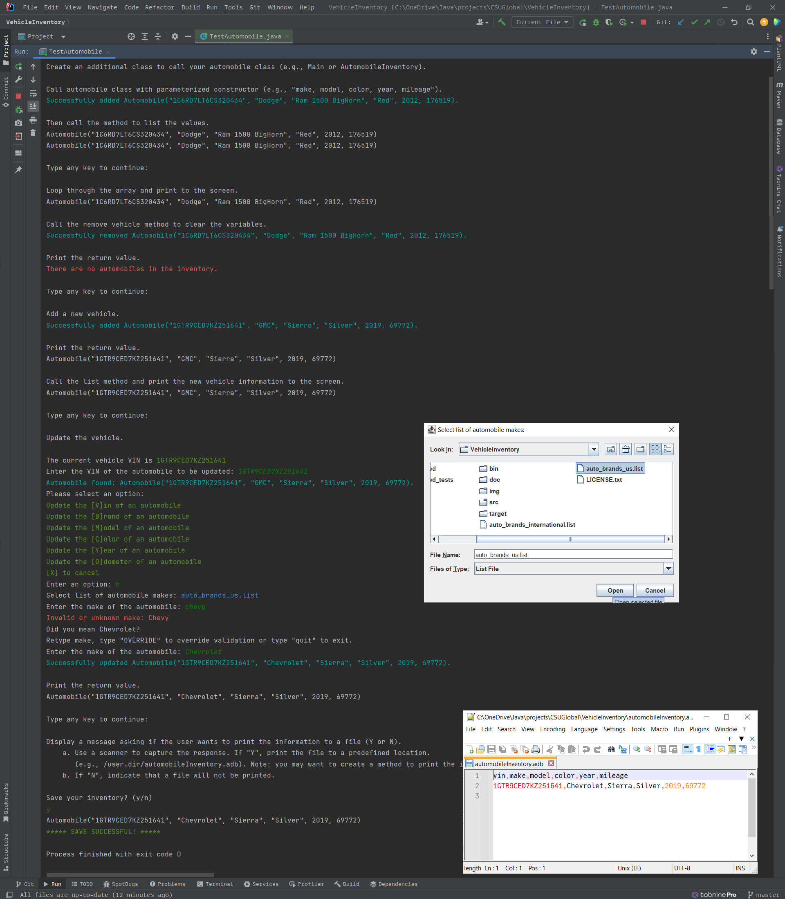

# CSU Global CSC320 2023 Fall B Final Portfolio Project

## Module 8: Portfolio Project

###  ***\*Portfolio Project (300 Points)\****

NOTES: 
This is a Maven project and must be imported as a Maven project in order to import dependencies.
The project may be run from /src/main/java/Main.java
The tests described below may be run from /src/test/java/TestAutomobile.java

### Option #1: 

#### Final Program Requirements

Create an automobile class that will be used by a dealership as a  vehicle inventory program. The following attributes should be present in your automobile class:

- private string make
- private string model
- private string color
- private int year
- private int mileage

Your program should have appropriate methods such as:

- default constructor
- parameterized constructor
- add a new vehicle  method
- list vehicle information (return string array)
- remove a vehicle method
- update vehicle attributes method

All methods should include try..catch constructs. Except as noted all methods should return a success or failure message (failure message  defined in "catch").

1. Create an additional class to call your automobile class (e.g., Main or AutomobileInventory). Include a try..catch construct and print it to the console.
2. Call automobile class with parameterized constructor (e.g., "make, model, color, year, mileage").
   - Then call the method to list the values. Loop through the array and print to the screen.
3. Call the remove vehicle method to clear the variables.
   - Print the return value.
4. Add a new vehicle.
   - Print the return value.
   - Call the list method and print the new vehicle information to the screen.
5. Update the vehicle.
   - Print the return value.
   - Call the listing method and print the information to the screen.
6. Display a message asking if the user wants to print the information to a file (Y or N).
   - Use a scanner to capture the response. If "Y", print the file to a  predefined location (e.g., C:\Temp\Autos.txt). Note: you may want to  create a method to print the information in the main class.
   - If "N", indicate that a file will not be printed.

Your final program submission materials must include your source code and screenshots of the application executing the application and the  results.

